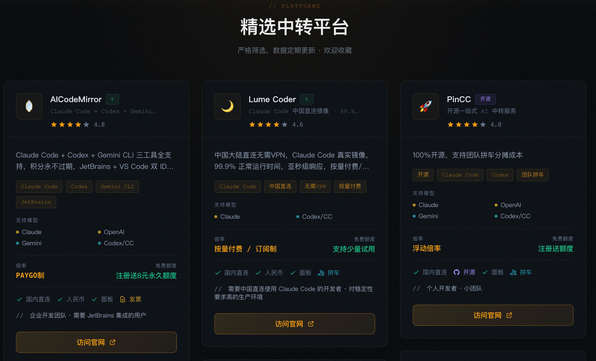
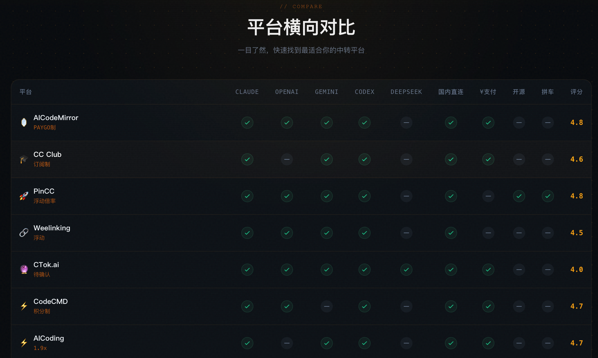

# ProxyCC - AI模型中转站导航

> 🚀 最全 AI 模型中转平台对比导航站 | 一键接入 Claude Code / OpenAI / Gemini

## 🔗 官网

**[https://proxycc.cc](https://proxycc.cc)**

---

---

## 📋 项目介绍

ProxyCC 是一个专注于 AI 大模型 API 中转服务的**导航对比平台**，为国内开发者解决以下痛点：

- ❌ 官方 API 国内访问困难
- ❌ 中转平台众多，难以选择
- ❌ 价格不透明，容易被坑
- ❌ 配置教程分散，找不到靠谱方案

**我们提供：**
- ✅ 主流中转平台一站式对比
- ✅ 实时价格、稳定性评测
- ✅ 详细接入教程（Claude Code / OpenAI / Gemini）
- ✅ 直达注册，快速上手

---

## 🎯 收录平台类型

| 类型 | 代表平台 | 适用场景 |
|------|---------|---------|
| Claude Code 中转 | 多个优质平台 | AI 编程助手 |
| OpenAI API 中转 | GPT-4 / GPT-3.5 | 文本生成 |
| Gemini 中转 | Google AI | 多模态应用 |
| 聚合中转站 | 一站式多模型 | 综合开发 |

---

## 🚀 快速开始

### 1. 访问导航站
打开 [https://proxycc.cc](https://proxycc.cc)

### 2. 选择平台
根据你的需求（价格/稳定性/模型支持）选择合适的中转站

### 3. 一键接入
点击跳转，按教程配置即可使用

---

## 📖 热门教程

- [Claude Code 国内使用教程](https://proxycc.cc/guide/claude-code)
- [OpenAI API 中转接入指南](https://proxycc.cc/guide/openai)
- [使用指南](https://proxycc.cc/guide)

---

## 🌟 为什么选择 ProxyCC？

| 特性 | ProxyCC | 其他 |
|------|---------|------|
| 平台覆盖 | 10+ 主流中转站 | 单一推荐 |
| 信息更新 | 实时维护 | 信息滞后 |
| 价格对比 | 横向对比表 | 无对比 |
| 使用门槛 | 零门槛导航 | 需自行搜索 |

---

## 🤝 合作与反馈

- 中转平台申请收录：[提交收录](https://proxycc.cc/submit)
- 问题反馈：[Issues](../../issues)

---

## ⚠️ 免责声明

本平台仅提供导航与信息聚合服务，不直接提供 API 服务。各中转平台的稳定性、价格、服务质量由其自身负责，请用户自行评估风险后使用。

---

## 📊 数据统计

- 收录平台：10+
- 覆盖模型：Claude / GPT / Gemini / 等
- 服务用户：持续增长中

---

**[⬆ 回到顶部](#proxycc---ai模型中转站导航)**
